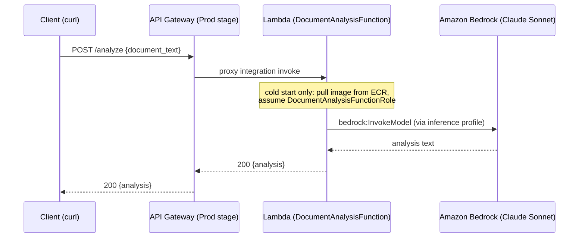

# Deploy a Strands Agent to AWS Lambda

Companion code for Chapter 6. Deploys a document analysis agent to AWS Lambda behind API Gateway.

## What You'll Build

A serverless Strands agent that analyzes contracts. POST a document, get back extracted terms, flagged risks, and a summary.

```
User → API Gateway → Lambda → Strands Agent → Bedrock (Claude) → Response
```

### Request data flow



Note: `template.yaml` also provisions an S3 bucket (`DocumentBucket`) with read access
granted to the function, but the current `src/app.py` never reads from it — the
document text comes directly in the request body, not from S3. It's provisioned
infrastructure with no data flowing through it yet.

## Prerequisites

1. **AWS CLI** configured (`aws sts get-caller-identity` should return your account ID)
2. **AWS SAM CLI** installed (`sam --version`)
3. **Docker** installed and running (`docker info`)
4. **Amazon Bedrock model access** enabled for Claude (Anthropic) models in your AWS account

### Windows Users

The deploy and cleanup scripts are bash scripts. On Windows, run them from one of these:
- **WSL (recommended):** Install [WSL](https://learn.microsoft.com/en-us/windows/wsl/install) with `wsl --install`, then run the commands from the WSL terminal. Make sure AWS CLI, SAM CLI, and Docker are accessible inside WSL.
- **Git Bash:** Comes with [Git for Windows](https://git-scm.com/downloads/win). Works for most bash scripts out of the box.

## Deploy

```bash
chmod +x deploy.sh cleanup.sh
./deploy.sh
```

The script auto-detects your machine architecture (arm64 for Apple Silicon/Graviton, x86_64 for Intel/AMD), builds the container image, and deploys to AWS. Takes 2-3 minutes.

## Test

Replace `YOUR_ENDPOINT` with the URL printed by the deploy script:

```bash
curl -X POST YOUR_ENDPOINT \
  -H "Content-Type: application/json" \
  -d '{"document_text": "This agreement is entered into by Party A and Party B. Party A shall deliver 1000 units by March 2026."}'
```

The first request is slow (cold start, 5-15 seconds). Subsequent requests are faster.

## Cleanup

```bash
./cleanup.sh
```

Removes all AWS resources created by the deployment.

## More Deployment Examples

For ECS (Fargate), AgentCore, and multi-agent deployments, see the official Strands tutorials:
https://github.com/strands-agents/samples/tree/main/01-tutorials/03-deployment
